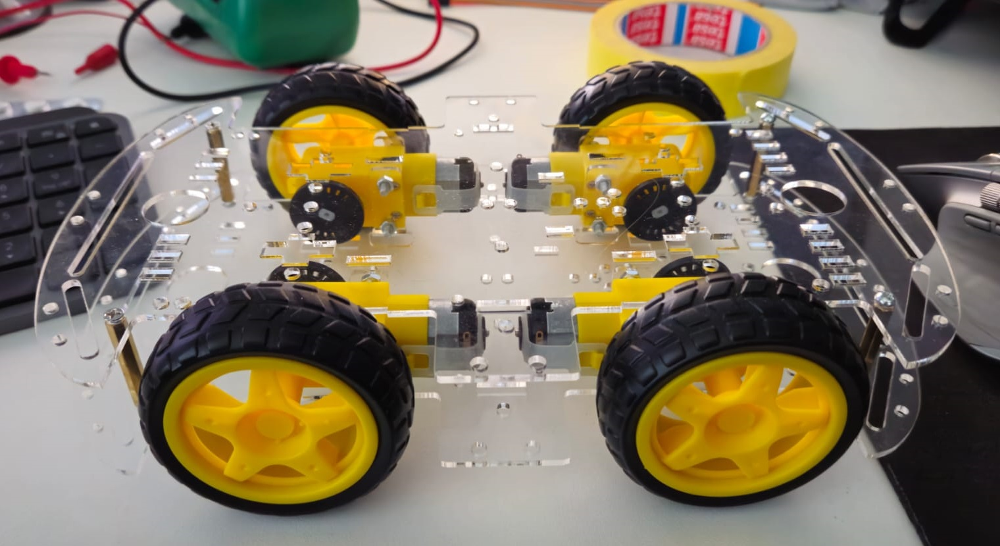
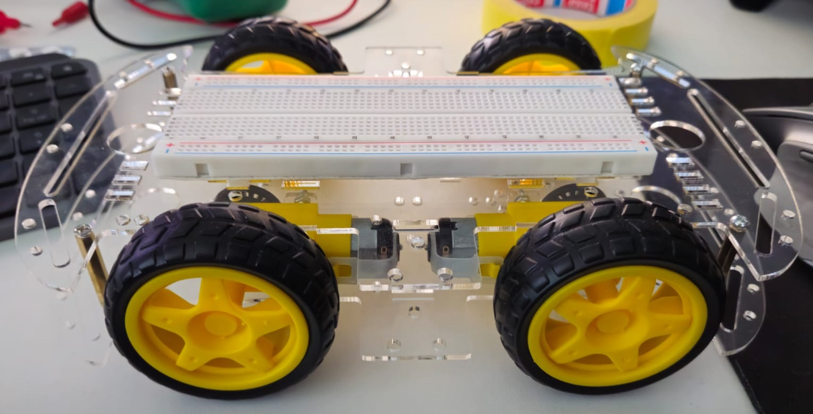
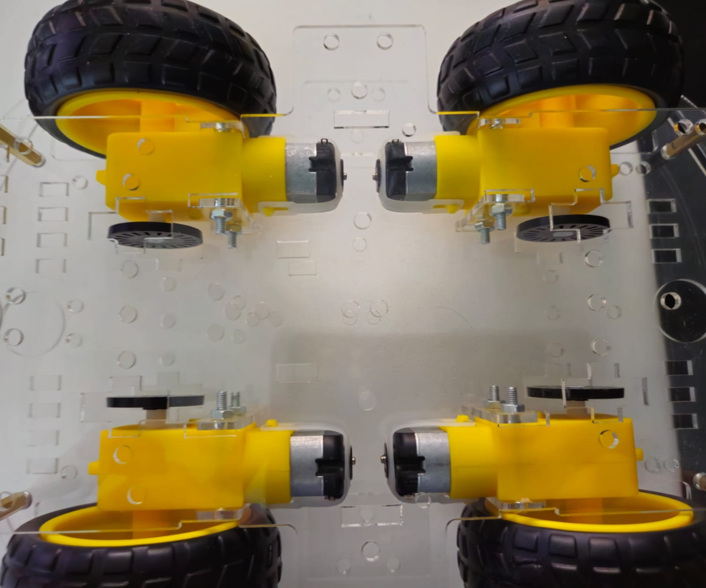
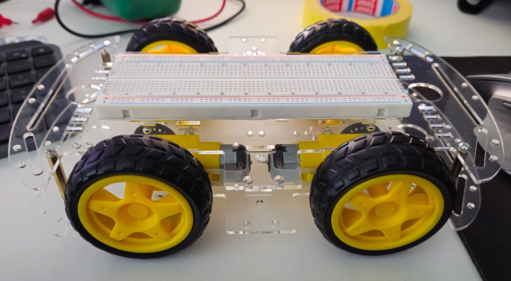
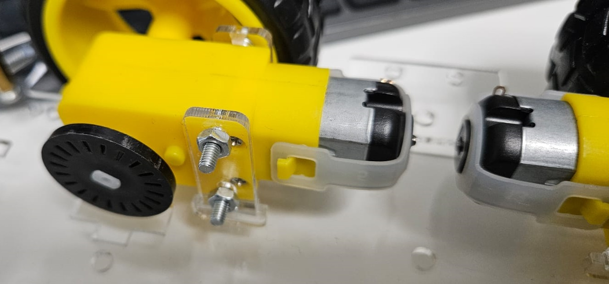
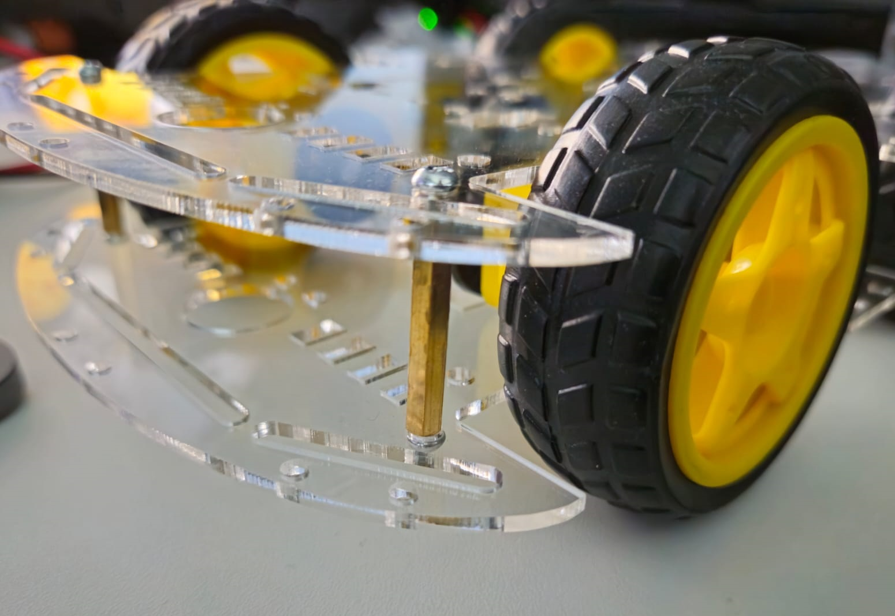

# Robot Car Structure

The robot car has a physical structure designed to accommodate various components, including sensors and two Arduino microcontrollers on breadboards.

## Freeform description - random facts about the project
- The RoboCar project is split into three different projects.
- All the projects are done in separate windows in VS Code PlatformIO.
    - **ARD1** which is the motor, radar and an pathfinder arduino SW project. 
    - **ARD2** which is the ESP-01 and OV7670 Arduino SW Project
    - **ESP1WS** which is ESP-01 webserver (and perhaps picture handling) SW Project.

**The project can use the following HW (but is not limited to).** 
**Dont think that these components must be used, they are here offered only for convenience.** 
Some parts must be used, but that's mentioned separately per component.
### Processing components
- 2x Micro Arduino (from now on called ard1 and ard2, like their projects but lowercase)
- ESP-01 8266 breakoutboard (from now on called esp1)

### Robot car kit with 4 motors (3-9 V DC)
- Almost 100% similar to this: https://eu.robotshop.com/products/diy-robot-car-smart-chassis-kit-w-speed-encoder-4w-2-layer-arduino-rpi
- A bigger description can be found behind the link. 
- The motors have discs with holes in them, which can be used to measure the speed of the motors.  
    - "TCRT5000 IR Infrared Sensor" can be used to measure speed

#### Carkit Specifications
- Voltage 4.5 - 9 V DC
- Current in idle state 190 mA
- Engine speed/min in idle 90 - 300 rpm
- Torque in gf/cm min 800 - 1200
- Dimensions (chassis) 280 x 156 x 3 mm
- Dimensions (wheel) 65 x 27 mm
- Car Weight 0.5 kg

#### Engine specs'
| Voltage DC V | Idle current mA | Idle rpm +- 10% | Torque gf/cm min. |
|--------------|-----------------|-----------------|-------------------|
| 4.5          | 190             | 90              | 800               |
| 6            | 160             | 190             | 800               |
| 7.2          | 180             | 230             | 1000              |
| 9            | 200             | 300             | 1200              |

## Power sources

The RoboCar has 4 Li-ion batteries which means that care must be taken to make sure that the 
batteries dont get shortcircuited and that their heat dissipation is taken care of.

For the Arduino robot, use the MF-R110AP polyfuse (Hold 1.10A, Trip 2.2A) in series with the 
positive line from the battery to the step-down converters to protect the electronics. For motor 
protection, use the MF-R400 polyfuse (Hold 4.0A, Trip 8.0A) in series with the positive line 
from the battery to the motor controller. Additionally, employ a 7.5A automotive blade fuse (ATC-7.5) 
in the power supply line to the motors. Utilize step-down converters to provide 5V for the 
Arduino and 3V for the ESP-01. Apply 3M 8810 thermal pads on high-power components for heat management.

If it turns out that the Li-ion setup is too difficult it must be changed to something else.

#### Possible polyfuses:
- MF-R90 hold 0.90A trip 1.8A
- MF-R110AP hold 1.10A trip 2.2A
- MF-R135 hold 1.35A trip 2.7A
- MF-R400 hold 4.0A trip 8.0A

### Power for motors
**2x 3,7 Li-ion rechargeable batteries in series (7,4 V nominal voltage, 8,4 V fully charged).**

Two 3.7V Li-ion batteries in series providing a nominal voltage of 7.4V (8.4V fully charged). 
This setup supports high current supply (5A per cell) and offers a capacity of 2000mAh to 3000mAh. 
For precise voltage requirements, a step-down converter can be used to regulate the voltage to 
the desired level. This configuration ensures a stable and efficient power source for the motors.

### Power for Arduino microcontrollers
**2x 3,7 Li-ion rechargeable batteries in series (7,4 V nominal voltage, 8,4 V fully charged).**

The power source for the computers and electronics of the robot car consists of two 3.7V Li-ion 
batteries arranged in series, providing a nominal voltage of 7.4V (8.4V when fully charged). 
To meet the specific voltage requirements of various components, step-down converters are utilized: 
5V for the Micro Arduinos, 3.3V for the ESP-01 module, and appropriate voltages for other components 
such as the ultrasound sensor, microwave radar, and LEDs. This configuration ensures a stable 
and high-capacity power supply, delivering efficient and reliable power distribution across all 
electronic components in the robot car.

## Moving structures, camera mount and ultrasuond radar in front
The robocar is equipped with an HS-SR04 ultrasound sensor mounted on a servo, allowing it to scan 
the front area for obstacles. This helps the robocar detect and avoid collisions. Additionally, 
the robocar has an OV7670 camera on a pan/tilt mount, controlled by two servos. This setup lets 
the camera move around to capture a wide view of the surroundings. These features work together 
to help the robocar navigate and understand its environment better. Currently there are no plans
to use the camera for obstacle avoidance, but it can be used for that purpose if needed.

## Lights
The RoboCar has a few leds around it to signify that it's active. The leds must be at a very low
power not to disturb people around it. Theres a set of leds which show that the car has power and
a set of leds which turn on a moment before it start moving and turn off a second after it stops.

The on option to integrate a bright led to the camera which can be turned on by an ambient light
sensor. This can be used to take pictures in dark places.

## Components which are available to use
- Breadboard (17, 30 and 60 row version available)
    - The robocar contain at least one 60-row breadboard
    - We can add very small 17-row breadboards if needed for difficult places
    - @TODO decide at start the board setup. 
- LM2596 DC-DC Converter Module and XL6009E1 DC-DC Converter Module
- 4x motors (as mentioned before)
    - TI SN754410NE H-Bridge Motor Driver for controlling the motors
    - 4x TCRT5000 IR Infrared Sensor for measuring the speed of the motors
- 4x 18650 Li-ion battery holder
    - 4x 18650 Li-ion batteries
    - 4x 18650 Li-ion battery charger
- TEMT6000 Ambient Light Sensor for controlling the camera light among other things
- Flyduino - A 12 Servo Controller (Arduino Compatible)
- A 10KO potentiometer for speed control
- SparkFun microSD Transflash Breakout (for storing nav data and potential maps)
- resistors, leds, potentiometers, buttons and basic components when needed

## General pictures of RoboCard

**Pictures are free to use for all** 

## Placement of components in the robot car chassis

## Electronics design

## User Manual
For detailed instructions on how to assemble and operate the robot car, please refer to the [User Manual](./manual.pdf) located in the same directory as this file.

## Dimensions
The length of the robot car is approximately 30cm, providing a compact yet functional size for its intended purpose.

## Sensor Integration
The structure of the car includes designated spaces to mount sensors. These sensors play a crucial role in gathering data and enabling the car to interact with its environment effectively.

## Arduino Microcontrollers
Two Arduino microcontrollers are integrated into the car's structure using breadboards. These microcontrollers serve as the brain of the car, controlling its movements and processing sensor data.

Overall, the physical structure of the robot car is carefully designed to house the necessary components, ensuring optimal functionality and performance.
